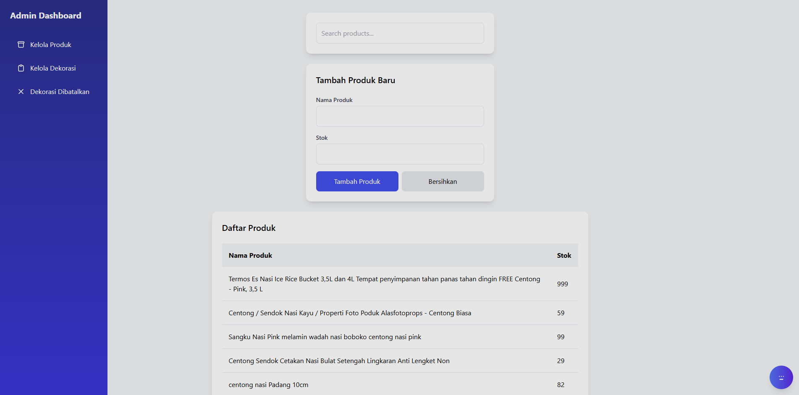

# Admin Dashboard for Decoration Management


## Overview


This project is a **responsive Admin Dashboard** built for managing products and decorations. It was developed as part of a pre-test interview to demonstrate proficiency in modern web development technologies, including **React**, **Tailwind CSS**, **Express.js**, and **MySQL**. The application allows users to manage products, track decoration purchases, cancel orders, and view product stock with a clean and intuitive interface.

---

## Table of Contents
- [Features](#features)
- [Technologies Used](#technologies-used)
- [Project Structure](#project-structure)
- [Setup Instructions](#setup-instructions)
- [Database Schema](#database-schema)
- [API Endpoints](#api-endpoints)
- [Screenshots](#screenshots)

---

## Features
- **Product Management**: Add, view, and search products with pagination.
- **Decoration Tracking**: Record and cancel decoration purchases with real-time stock updates.
- **Responsive Design**: Optimized for both desktop and mobile devices with a collapsible sidebar.
- **Interactive UI**: Smooth animations, form validations, and user-friendly alerts using SweetAlert2.
- **RESTful API**: Backend powered by Express.js with MySQL for data persistence.
- **Real-time Data**: Fetches and updates product and decoration data dynamically.

---

## Technologies Used
- **Frontend**:
  - React 18.2.0
  - Tailwind CSS
  - SweetAlert2 for alerts
  - Axios for API requests
- **Backend**:
  - Express.js 5.1.0
  - MySQL2 3.14.2
- **Database**: MySQL (MariaDB 10.4.32)
- **Development Tools**:
  - Nodemon for development
  - Babel for JSX transpilation

---

## Project Structure
```
task-test-1/
├── public/
│   ├── css/
│   │   └── global.css        # Global styles
│   ├── js/
│   │   ├── app.js           # Main React application
│   │   ├── CancelForm.js    # Component for canceling decorations
│   │   ├── DecorationForm.js # Component for adding decorations
│   │   ├── DecorationList.js # Component for listing decorations
│   │   ├── ProductForm.js   # Component for adding products
│   │   ├── ProductList.js   # Component for listing products
│   │   ├── Sidebar.js       # Sidebar navigation component
│   └── index.html           # Main HTML file
├── src/
│   └── index.js             # Express.js server
├── package.json             # Project dependencies and scripts
└── README.md                # Project documentation
```

---

## Setup Instructions
Follow these steps to set up and run the project locally:

1. **Clone the Repository**:
   ```bash
   git clone https://github.com/kyy-95631488/Admin-Decor-Management.git
   cd Admin-Decor-Management
   ```

2. **Install Dependencies**:
   ```bash
   npm install
   ```

3. **Set Up MySQL Database**:
   - Ensure MySQL is installed and running.
   - Create a database named `decoration_db`.
   - Run the SQL script provided in the project to create tables and seed initial data:
     ```sql
     source decoration_db.sql
     ```

4. **Configure Database Connection**:
   - Update the database configuration in `src/index.js` with your MySQL credentials:
     ```javascript
     const db = mysql.createConnection({
         host: 'localhost',
         user: 'your-username',
         password: 'your-password',
         database: 'decoration_db'
     });
     ```

5. **Start the Backend Server**:
   ```bash
   npm run dev
   ```

6. **Access the Application**:
   - Open `http://localhost:3000` in your browser to view the dashboard.

---

## Database Schema
The application uses three main tables:
- **Produk**: Stores product details (id, name).
- **Stock**: Tracks product stock (id, product_id, quantity).
- **Pembelian**: Records decoration purchases (id, product_id, quantity, purchase_date).

### SQL Schema
```sql
CREATE TABLE produk (
    id INT AUTO_INCREMENT PRIMARY KEY,
    name VARCHAR(255) NOT NULL
);

CREATE TABLE stock (
    id INT AUTO_INCREMENT PRIMARY KEY,
    product_id INT,
    quantity INT,
    FOREIGN KEY (product_id) REFERENCES produk(id)
);

CREATE TABLE pembelian (
    id INT AUTO_INCREMENT PRIMARY KEY,
    product_id INT,
    quantity INT,
    purchase_date DATE,
    FOREIGN KEY (product_id) REFERENCES produk(id)
);
```

---

## API Endpoints
- **GET /api/products**: Retrieve all products with their stock.
- **POST /api/products**: Add a new product and update stock.
- **POST /api/decorations**: Record a new decoration purchase and reduce stock.
- **DELETE /api/decorations/:id**: Cancel a decoration purchase and restore stock.
- **GET /api/decorations**: Retrieve all decoration purchase records.

---

## Screenshots
### Dashboard Overview


### Cancel Decoration


### Decoration Management


---